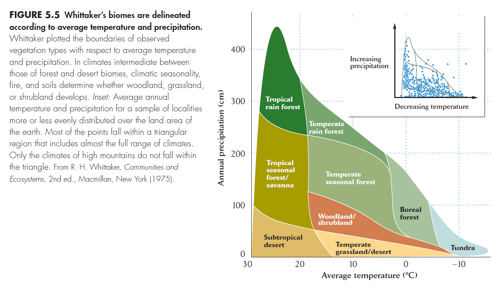

# Raster data

## General R functions

### Download data
You can download data directliy in R using `download.file()` function. In this example we will download the CHELSA climate - BIO1 (Mean annual temperature - °C) and  BIO12 (Annual Precipitation - mm) for 1981-2010. Check `?download.file` for arguments and options.  

``` r
download.file("https://os.unil.cloud.switch.ch/chelsa02/chelsa/global/bioclim/bio01/1981-2010/CHELSA_bio01_1981-2010_V.2.1.tif", "data/CHELSA_bio1_1981-2010_V.2.1.tif")
download.file("https://os.unil.cloud.switch.ch/chelsa02/chelsa/global/bioclim/bio12/1981-2010/CHELSA_bio12_1981-2010_V.2.1.tif", "data/CHELSA_bio12_1981-2010_V.2.1.tif")
```

### Listing files
You can list files in any directory using `list.files()` function. With argument `pattern` you can filter the files by matching string - *regular expression* *(regex)*, for example part of the name or file extension.

``` r
list.files()
```
list all files in the current directory recursively

``` r
list.files(recursive = TRUE)
```

or list all files in subdirectory `data`:

``` r
list.files("data")
```

get the relative path of the files :

``` r
list.files("data", full.names = TRUE)
```

use `pattern` to filter the files with regex
``` r
list.files(recursive = TRUE, pattern = "bio")
```

## Raster manipulation
Task: 

1. Prepare raster stack of bioclimatic CHELSA data and elevation data for the Czechia. The resolution of the raster stack will be 30seconds (~1km) - resolution of the CHELSA data.
2. Mask the raster stack with the DEM data.
3. Save the raster stack to separate files.


```r
library(terra)
```

read all raster files in the directory `data`:

```r
raster_files <- list.files("data", pattern = ".tif$", full.names = TRUE)
```
!!! note
    Notice that we used `pattern = ".tif$"` to filter only the files with `.tif` extension. The `$` means that the string should end with `.tif`.

```r
r <- rast(raster_files)
```

!!! info
    Function `rast()` can read also files directly from url string.
    
    ```r
    urls <- c(
        "https://os.unil.cloud.switch.ch/chelsa02/chelsa/global/bioclim/bio01/1981-2010/CHELSA_bio01_1981-2010_V.2.1.tif",
        "https://os.unil.cloud.switch.ch/chelsa02/chelsa/global/bioclim/bio12/1981-2010/CHELSA_bio12_1981-2010_V.2.1.tif"
        )
    r <- rast(urls)
    r
    ```

If we want to read all raster in stack, all rasters have to have the same extent, resolution and projection. We have to preprocess the data before.

try to read only CHELSA bioclimatic files and dem separately

```r
bio <- rast(list.files("data", pattern = "bio", full.names = TRUE))

dem <- rast("data/eu_dem.tif")
```
### get the same extent

For clipping raster object to specific extent use `crop()` function. It can crop the raster with extent object, or other raster object (retrieve the extent from the other raster).

```r
bio_cz <- crop(bio, dem)
```
Extntes do not overlap, we need to reproject the raster to the same projection.

```r
dem_4326 <- project(dem, crs(bio))
bio_cz <- crop(bio, dem_4326)
```

Reprojecting can be also done with EPSG code directly with string `EPSG:****` 

```r
dem_4326 <- project(dem, "EPSG:4326")
```


!!! note "Technical note"
    Notice that `project()` function can also reproject the raster to the same projection, resolution and extent as the other raster with argument `to`.


### resample to the same resolution

see `?resample` for more options, particularly `method` argument. In our case we will use some sumary method

```r
dem_4326 <- resample(dem_4326,bio_cz, method = "average")
```

### stack the rasters

```r
cz_stack <- c(bio_cz, dem_4326)
```
### masking
mask the raster stack with the DEM

```r
masked_z <- mask(cz_stack, dem_4326)
plot(masked_z)
```
or mask all raster in stack with any NA in any raster

```r
masked_z <- mask(cz_stack, anyNA(cz_stack))   
```

### write the raster stack to separate files
The raster stack can be written to single file with multiple layers as bands, or to separate files.

Write to single file with multiple bands:

```r
writeRaster(masked_z, "output/cz_stack.tif")
```

To write the SpatRaster to separate files you have to provide the file names for each layer.

```r
writeRaster(masked_z, c("output/cz_bio1.tif", "output/cz_bio12.tif", "output/cz_dem.tif"))
```
Or more usually you can use `names()` function to get the names of the layers, and use a `paste0()` function to construct the file names with the layer names.

!!! note "`paste0()` "
    `paste0()` function is used to concatenate strings without any separator.
    ```r
    paste0("Hello ", "World")
    ```
    If you provide a vector with multiple values, it will concatenate each value with the previous string. 
    ```r
    paste0("Hello ", "World - ", c(1, 2, 3))
    ```

    So in our case we can use `names(masked_z)` to get the names of the layers and construct the file names with `paste0()` function.

    ```r
    paste0("output/", names(masked_z), ".tif")
    ```

Befor we write the files, we can set reasonable names for the layers in the SpatRaster object with `names()` function.

```r
names(masked_z) <- c("bio1", "bio12", "dem")
writeRaster(masked_z, paste0("output/cz_", names(masked_z), ".tif"))
```


!!! note
    Still you can pick out single layer from the SpatRaster object and write it to file separately.

    ```r
    writeRaster(masked_z$CHELSA_bio01_1981.2010_V.2.1, "output/cz_bio1.tif")
    ```
    or
    ```r
    writeRaster(masked_z[[1]], "output/cz_bio1.tif")
    ```


## Categorical data and raster attribute table (RAT)
Tasks: 

1. Create raster of distances to the nearest forest in Czechia.
2. Compare the elevation ranges between areas of Broad-leaved forest and Coniferous forest in Czechia.

In this example we will use Corine Land Cover (CLC) data, which is a categorical raster data, that come with raster attribute table (RAT). The RAT contains the information about the categories names and their CLC codes while the raster values are categories numbers from 1 to 45. We will use this information to create a raster of distances to the nearest forest.

```r
clc <- rast("data/U2018_CLC2018_V2020_20u1.tif")
clc
```

Note the `categories` in the metadata of SpatRaster object, it shows the column names in RAT. We can access the categories with `cats()` function.

```r
cats(clc)
```

The first column is `Value` and its actaully the value stored in the raster. But in prints the first category is showed as label of the value. Thats why we see in the metadata `name` the `LABEL3` category, and also `min value` and `max value` are shown from this category. If we plot the raster, it will also use the `LABEL3` category as labels in the legend.

```r
plot(clc)
```

The label can be changed with `$` operator, but keep in mind that the values in the raster will not change, only the labels. 

```r
clc$CODE_18
plot(clc$CODE_18)
```

**Crop and mask the CLC raster**

We used the `dem` raster to crop the `clc` but same as in previous example, we need to reproject the `dem` raster to the same projection as `clc` before cropping.

```r
dem_3035 <- project(dem, crs(clc))
clc_cz <- crop(clc, dem_3035)
```

### Distance to the forests

For this tasks we will use the `distance()` function, which calculates the distance to the nearest non-NA cell in the raster. So at first we need to get a raster with NA value for all pixels that are not forests.

If we look at the RAT table we will see that the values for forests are `23`,`24` and `25` for `Broad-leaved forest`, `Coniferous forest` and `Mixed forest` respectively.

``` r
cats(clc_cz)
```

Prepare the raster with NA for non-forest pixels:

```r
clc_forests <- clc_cz
clc_forests[clc_forests != 23 & clc_forests != 24 & clc_forests != 25] <- NA
plot(clc_forests)
``` 
Calculate the distance to the nearest forest pixel:

```r
forests_d <- distance(clc_forests)
plot(forests_d)
```

Write the distance raster to file:

```r
writeRaster(forests_d, "output/forests_distance.tif")
```


### Explore the elevations between areas of Broad-leaved forest and Coniferous forest in Czechia.

```r
dem_3035 <- resample(dem_3035, clc_cz, method = "average")
clc_cz <- mask(clc_cz, dem_3035)
```

We can now work in single SpatRaster object, or with separate rasters, but we need to make sure that they have the same resolution and extent.

```r
broad_leaved <- clc_cz == 23
coniferous <- clc_cz == 24
```

Mask the elevation raster with the forest rasters to get the elevation values for each forest type. Now we have binary rasters with `TRUE` (`1`) and `FALSE` (`0`) values. The value of amsk can be set with `maskvalues` argument in `mask()`  (default is `NA`).

```r
broad_leaved_elev <- mask(dem_3035, broad_leaved, maskvalues = FALSE)
coniferous_elev <- mask(dem_3035, coniferous, maskvalues = FALSE)
```

Now we can get the summary statistics for each forest type.

```r
summary(broad_leaved_elev)
summary(coniferous_elev)
```

Or extract the values as vectors and work with them directly.

```r
val_broad <- as.vector(values(broad_leaved_elev))
val_conif <- as.vector(values(coniferous_elev))
```

Plot the elevation values for each forest type.


Boxplot
``` r
boxplot(val_broad, val_conif)
```
or with additional graphics
```r
boxplot(val_broad, val_conif, 
        names = c("Broad-leaved", "Coniferous"), 
        col = c("lightgreen", "darkgreen")
        )
```
Histograms
```r
hist(val_conif)
hist(val_broad, add = TRUE)
```


or with additional graphics
```r
hist(val_conif, col = "darkgreen")
hist(val_broad, col = "lightgreen", add = TRUE)

legend("topright", c("Broad-leaved", "Coniferous"), 
       fill = c("lightgreen", "darkgreen"))

```


!!! tip
    If we neeed to work directly with the values, we can also do it with `values()` function. The workflow than should be something like this::

    ```r
    broad_leaved <- clc_cz == 23
    broad_leaved_elev <- values(dem_3035)[values(broad_leaved)]

    coniferous <- clc_cz == 24
    coniferous_elev <- values(dem_3035)[values(coniferous)]
    ```


## Other exercises


```r
download.file("https://geodata.ucdavis.edu/climate/worldclim/2_1/base/wc2.1_
    10m_bio.zip","wc2.1_10m_bio.zip")

unzip("wc2.1_10m_bio.zip", exdir = "data/")
```

Read the data with `terra` package.
```r
library(terra)

bio_list <- list.files("data",full.names = T)[c(1,4)]
r <- rast(bio_list)
```

```r
names(r) <- c("temp", "prec")
plot(r)
```


---
=== "Biomes classification"
    
    Classify the biomes based on the temperature and precipitation values of the WorldClim data. Use the following classification based on Whittaker's biomes classification:
        
    
  
=== "Tropical rain forest"
 
    ``` r
    trop_for <- (r[[1]] < 20 & r[[2]] < 2500)
    plot(trop_for)
    ```
=== "Subtropical desert"
 
    ``` r
    sub_des <- (r[[1]] > 15 & r[[2]] <1000)
    plot(sub_des)
    ```
